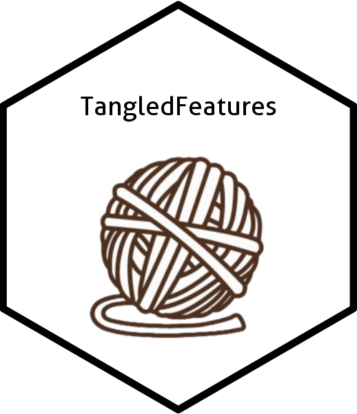

# TangledFeatures  
 
<!-- badges: start -->
[](https://CRAN.R-project.org/package=TangledFeatures)
<!-- badges: end -->

TangledFeatures provides a feature selection method that is meant to be fed into a linear or logistic regression. The algorithm handles the interrelationships between variables using a mix of correlation and graph theory methods. 


## Installation

You can install the development version of TangledFeatures like so:

``` r
package(TangledFeatures)
install_github("TangledFeatures/TangledFeatures")
```

## Usage

TangledFeatures()

## Documentation

This is a basic example which shows you how to solve a common problem:

``` r
library(TangledFeatures)
## basic example code
```

  
